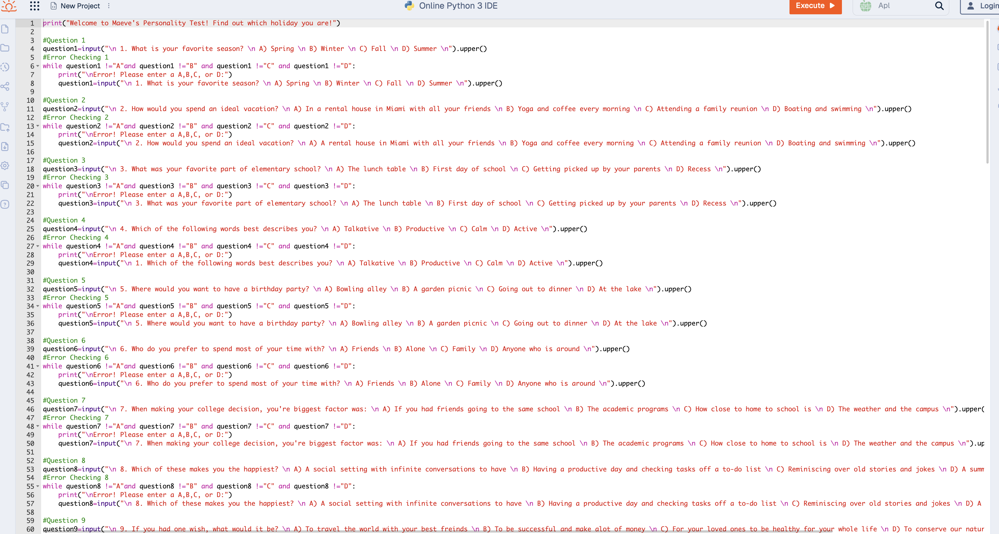

# Maeve Sullivan Portfolio

This is a portfolio for Maeve Sullivan
# Maeve Sullivan
Contact Info: (585) 455-1053
Email: msullivan17@loyola.edu
### About Me 
Hello! I am an experienced Pediatrician and Medical professional with over 5
years of proven expertise in Medicine and Pediatrics. 

With skills in clinical care, open communication, medical research, and education, I am able to treat kids of all ages, and achieve strong patient and family relations. I am adept at using digital spreadsheets, diagnostic tools, and computer coding systems. 

My diverse skill set, commitment to family health, and passion for research me as a valuable asset.  In my spare time, I like to alpine ski and travel. 

You can find me on Instagram or Moodle.

### Education 
Pittsford Sutherland High School, Loyola University Maryland
***
### Projects

#### Bi-Weekly Time Sheet
 -  I created an excel spreadsheet that allows me to track my hours in a research lab and embedded many specific formats and functions within in order to be able to do these calculations automatically.
 
 

- Initial Project Idea:

 I came up with this project as I wanted an easy way to track my hours that I work in my research lab affiliated with my medical office. 

 - Tools I Used:

 I used excel and its complex functions in order to complete this project.

 - Challenges I faced: 

 The challenges that I faced were that I had trouble getting the correct format of time within the sheet as, when it had to be a specific format in order for the calculation to be automatic.  I overcame this challenge by talking to my peers in this field.

 - Result:

 My result was that I created a timesheet that is able to track and calculate my total hours worked over of biweekly period. If I had the chance to take this farther, I would add more slots for other workers in the lab, so that I could also have an easy place to keep track of my coworkers hours as well.

***
#### Personality Test
 - I created a creative and engaging personality test on Python using a variety of algorithms for people to find out which holiday they correspond to.

 
 

 - Inital Project Idea:

 I came up with this project as I wanted to create an engaging and creative personality test to use with my coworkers in order to get to know each other and form relationships.

 - Tools I Used:

 I used python in order to code for this personality test.

 - Challenges I Faced:

 The challenges that I faced were that I had problems getting my code to run the proper error checking method which is a crucial part of this test as it prevents the results of the test from being messed up.

 - Result: 

 My result was that I created a test that prompts the reader ten questions, and based on their answers it tells the reader which holiday they are based on the algorithms and codes that I created, it also has error checking methods that prevent the results from being messed with the entrance of a wrong letter or symbol.

***
#### Grade Calculator
 - I created an advanced and highly functional Excel algorithm that generates a letter grade based on users varying assignment scores and weights.

 
 

 - Inital Project Idea: 

 I came up with the idea of a grade calculator as I wanted a sheet that would automatically generate my grade for classes in medical school which helped reduce test anxiety. 
 - Tools I Used:

 I utilized Excel and its numerous advanced functions such as “if statements” that allowed me to create equations and formats resulting in automatic calculations.

 - Challenges I Faced:

 I faced challenges when creating “if statements”. At first, my equations and formats would not generate an F, even when the grades inputted should have yielded this letter. I faced this by watching professional videos that helped explain the complicated and advanced algorithms of Excel.

 - Result:

 I created a sheet in Excel that allowed the user to enter their grades on assignments and the respective weight of the assignments, which ultimately was able to automatically generate a letter grade.

